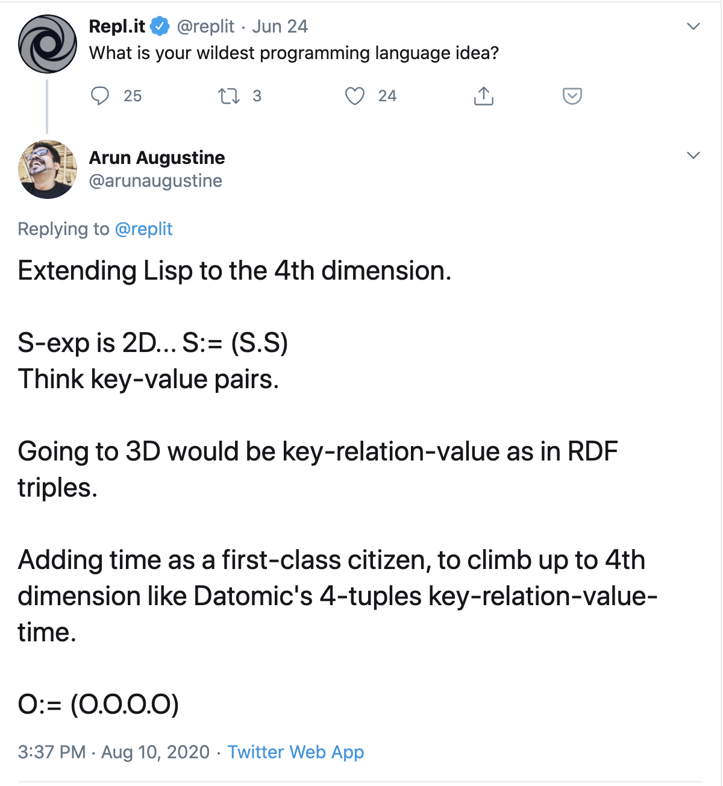

# Roman, a Lisp like programming language in the 4th dimension.
Roman is Lisp extended to 4-dimensions. 

The foundational idea of this programming language is simple enough to fit in a tweet 

(see image "omicron_tweet.png")

(With the caveat that you are already familiar with Lisp’s s-expressions, RDF triplets and Datomic, a database designed by Rich Hickey who also designed Clojure, a popular, modern dialect of Lisp targeting the JVM ecosystem).




So what does that buy us? What’s the key benefit? 

The short version of the answer is: I don’t know (yet).

The longer version is that, all I have currently, is an intuition that, by “climbing the dimensions” so to speak, the language will become more expressive. Perhaps even approaching closer to natural languages (e.g english) in ease of expression.

And since it has the additional property of being executable in comparison to natural languages, it just might help us “explore grander thoughts”. And of course, this is pure speculation at the moment .

For now, let’s just begin with the idea of an alternate universe in which Lisp like language was conceived from a set of slightly different starting assumptions.

Instead of S-expressions, we use O-expressions as the basis for Roman, which is defined recursively (similar to S-expressions) as `O : O.O.O.O` 

Let’s just begin here and see where it will takes us. 

# Core Guiding Principles
While I do have an early working prototype and some examples of how code in Roman looks like, **I would urge you to read through to the end of this article first** before exploring the code or playing with the prototype interpreter.

The prototype is barely two weeks old, as frail and underwhelming as a new born baby. 

Add to that  fact that I am a beginner to Rust programming language in which I am currently prototyping Rome, Roman’s interpreter, and that my learning is currently going at a slow leisurely pace, enjoyable and frustrating in equal measures. 

So please bear with me.


## Going from 2nd to 4th dimension
Let’s start with a quote from the seminal 1960 paper of John McCarthy which introduced Lisp to the world.

> In the course of it's development, the LISP system went through several stages of simplification and eventually came to be based on a scheme for representing the partial recursive functions of a certain class of symbolic expressions...and it now seems expedient to expound the system by starting with the class of expressions called S-expressions.    
>   
> …….  
>   
> An S-expression is then simply an ordered pair, the terms of which may be atomic symbols or simpler S-expressions.  
>   
> -- **John McCarthy** in the seminal paper that introduced Lisp to the world in April 1960.  


He proceeds to symbolically express this idea as:

S : (S . S)

That is, any of the `S` on the right hand side as either be a terminal symbol that cannot be further expanded called an atom or one that can be expanded recursively in the same manner, as another `(S. S)`.

The whole of Lisp is built up from this scheme of S-expressions. 

**It’s turtles all the way down.**

Hmm....So an S-expression is simply an ordered pair (yes, and recursive…I know)
But why a pair? (….reminds me of Key-Value pairs….)

Why not three? (Like you know: Key, **Relation**, Value, like in RDF triplets? )

You know what, better stil...Why not four?
4-tuples. Key, relation, value **+ Time**? (like in Datomic?).

### O-expressions

What if, instead of S-expressions, we start with ....say O-expressions
   
 O : O.O.O.O

Where each O can be:

	* expanded further as (O . O . O .O)
	* or it can be a terminal symbol.
	* or it can be an S-expression

Will we end up with a Lisp like language that's somehow more expressive? 
Will we be able to programmatically play with time?

Let’s find out.

### Are you asking or telling? 

In most programming languages when you write:
```
x = 5
```

This means, we are telling the computer that x from now-onwards has the value 5. 

And when we write:

```
x > 5
```

We are **asking** the computer if x is greater than 5 (for example as part of an if statement). Currently there is no way we can **tell** the computer that `x > 5` and ask it to remember that as a “fact”. 

For example imagine we would like to do the following in javascript:

```javascript

let x > 5; // define as a fact that x is greather than 5.
let y = 3; // define as a fact that y is equal to 3.

if(x > y) print "true"; // should print "true"
```

If our programming language supports **telling** computers facts of any kind, and not just about equality, our programs would be more expressive don’t you think?

Of course, this is nothing new.

Prolog has supported this kind of assertions and queries for a long time, and so has SAT solvers for similar logical reasoning.

**And then there’s the aspect of Time.** 

Time traveling queries (Datomic has this one), time traveling debugging (in Elm) , temporal logic (Leslie Lamport’s TLA+ and PlusCal)……there’s no lack of precedent for playing with time programmatically.

So what if by adding two more dimensions to s-expressions, namely, “relation” and “time” to “key”, “value” pairs,  our programming language could be more expressive? 

For example I think it would be nice if our language supports both 

**asking** the computer `x > 5 ?` “Is x greater than 5 at the moment?” and also 
**telling** the computer `x > 5 .` (“From no on, X is greater than 5 PERIOD!”).

What if we could write tests that said, at every step of eval, a function should return a monotonically increasing integer for example? 

“output of function foo at T should be **of type int AND greater**  than foo’s output at T-1”

## Making the jump to the 4th dimension
To make this jump from 2-dimensions to 4-dimensions, we are going to take another small detour from Lisp’s conventions. Lisp designates the first item in a list of s-expressions as the procedure or function name. The rest of the items in the list is treated as arguments or parameters to this procedure/function. This, as you know is the pre-fix notation.

 In Roman, we consider the very last symbol in a list of o-expressions as the function name, and treat rest of the items (from head to the second last item in the list) as arguments to this function.

That is,  instead of pre-fix notation that Lisp uses, that is considering the first form in a list of s-expr as the function name, we consider the last form as the function or operator name. (Similar to post-fix notation). 

Now if this was all the change we did, we would still end up with a Lisp, albeit one that reverses the order of function and it’s arguments. 

Let’s make things concrete with an example before we continue.

Let’s start with defining a variable in Lisp.

```
(def x 5)
```

Here, `def` is the procedure (ok, it’s actually a special form, but that distinction doesnot affect our discussion). It’s passed two arguments, a name (`x`) and a value `5`. Lisp interpreter then somehow stores that fact that x is 5 in the program’s runtime environment.

In Roman, we will do the equivalent by the following expression:

```roman

(x = 5 .)

```

Actually, to make it easier for humans, Roman automatically supplies the outermost enclosing parenthesis. So the above Roman expression can be written simply as:

```roman

x = 5 .

```

Let’s break down how this works in Roman.

As you know, in Roman, the convention is the very last symbol in the expression is the function name and the rest of the items is considered as it’s arguments. 

### Introducing the Roman PERIOD ( . )  operator, maker of definitions.

In Roman, the full-stop punctuation (aka period) symbol is the equivalent of `def` or `define` in Lisp. (As in `(def x 5)`)

In Roman, the PERIOD takes three (instead of two in Lisp) arguments

* A name for the variable (`x`) 
* A value (`5`) 
* A symbol denoting the “relation” between name and value (`=`)

Since the symbol denoting the “relation” between “name and “value” is explicit, we can handle definitions like the following:

```

x > 4 .
x < 6 .

```


Also notice that the “relation” symbol is passed in as the second argument from the head of the list. This is another Roman convention. All three symbols are just arguments to the period operator( . ). We could just as well  ave defined `.` to take them in a different order. It’s just that we chose to have the “relation” symbol to be in the second position.

Roman calls these “relation” symbols as **verbs**. It calls the expression or symbol in the very first position on the list as the **subject** and the remaining items excluding the very last symbol (our function name as “**objects**” (there can be more than one objects, but only one subject and verb by Roman convention).

Note that (`.`) etc are not any kind of exception to the rule in Roman. Sure, it is built-in to the core language, but the following expressions will also work as you might expect

```
1 2 3 +   

4 2 -

4 square

```

These will print out, respectively `6`, `2` and `16` (assuming square is a known function, we will come to defining functions shortly).

The author of the function has a choice on how exactly to treat the list of arguments passed into the function. You can also choose to implement 4D functions that looks at the second argument and decide what to do with the subject and (arbitrary long list of) objects.

To bring up one final subtle point, you can see that the `.` function is somehow related to the concept of Time. Because it’s basically saying that “From now on, let it be known as a fact that….so & so is so & so etc”. 

And of course, to ask questions instead of making definitions, Roman has a second built-in punctuation-like-function.

### How to ask a question in Roman ? 

To check if a is greather than b in Roman, we would write

```
a > b ?
```

`?` is similar to `.` in that it takes a **verb** (here it is `>`) and performs a conditions check. `?` can also similarly handle `<` `=<` `>=` , `~=` (not equal to) and so on.

Even `if else` is handled by our query operator.

```
x if (x > 0 ?) else -x ? 
``` 

Here the verb passed-in to `?` is `if`. And the definition of the branch of code that handles the `if` verb takes three arguments as **objects** apart from the **subject** (`x`). 

* The first is a another `?` query that returns true or false
* The second object is the “keyword” `else` 
* The third is another value expression `-x` which is returned if the predicate expression (the first object) returns false.

### How to define a function (lambda) in Roman

Here’s how we write an anonymous function definition in Roman

```
(a) => (a 1 +) fn
```


If you wish to give a name to your function you would do

```
square = (x => (x x *) fn) .
```


Here `fn` is the function. And  `=>` is treated as the verb to  `fn` . The **subject** is either a symbol or a list which is treated as argument list and the third item, the **object** is the body of the function.

Then we use our familiar `.` to assign a name to this anonymous function.

### The ! operator

In Roman, side effects like printing to the STDOUT is modeled as a message sent out from the program (more on that later), for which we use the `!` operator (like the message operator in Erlang). So to print out the value of a constant, we would write it as:

```
a !

```


Roman calls `!` the “ping” operator. 

### Comments and Holes

Roman uses two dashes `-- ` to denote a one liner comments (like in Elm) and a pair of three dashes `---` by themseles on an empty line surrounding a multi-line comment.

To comment out code so that Roman’s evalutor won’t complain, we use a semi-colon to end the expression `;`. Called a “Hole” operator, it signals to Rome (the Roman interpreter) that this expression is under construction and the programmer would like to ignore the warning and error messages for now. (To mark a bigger block of code as under construction, we just need to surround it with parenthesis and add a `;` at the end.

Oh my, this became quite a long article. Perhaps, *now* we can play around with my barely functioning, frail and potentially underwhelming prototype of the Roman interpreter (aka Rome).

(Warning: comments and holes are not yet implemented in the Rome prototype)

Oh one last thing…

## What’s in a name
Rome is short for **Recursive Omicron Meta Evaluator**. 

This is because we chose the capital Omicron symbol to denote O-expressions. 


The program language is itself called Roman which is short for **Recursive OMicron Algebraic Notation**, because you know, after all Algebra is nothing but the manipulation of symbols along with a notation or way to describe those manipulations.

Plus you know……. the domain name was available.

## Thanks
A special thanks to [Stepan](https://stopa.io/post/222), on whose tall shoulders, I stood, to figure out how to express all these ideas in Rust. He in turn based his Rusty Lisp interpreter on [Norvig’s Lispy](http://norvig.com/lispy.html).

It was [Paul Graham's essays](http://www.paulgraham.com/lisp.html) which introduced me to Lisp more than 10 years ago. And it was [Alan Kay](https://queue.acm.org/detail.cfm?id=1039523) along with [Fred Brook's mythical man-month](https://en.wikipedia.org/wiki/The_Mythical_Man-Month), [Michael's blog post on Lisp](http://www.michaelnielsen.org/ddi/lisp-as-the-maxwells-equations-of-software/) and of course the venerable [authors of SICP, Harold Abelson and Gerald Jay Sussman](https://en.wikipedia.org/wiki/Structure_and_Interpretation_of_Computer_Programs) who taught me about the mind altering experience that Lisp is. 


To these teachers, who may not realise that I am their student: Thank you! 

And not in the least to my sincere thanks to the [repl.it team](https://repl.it/jam) who devised the programming language contest, thereby unknowingly becoming my accountability partner to share this idea that took hold of me 6 years ago, and that only now I could put down in some semblance of coherent words and working code.

Finally also to you dear reader, I say: so long and thanks for all the fish.
